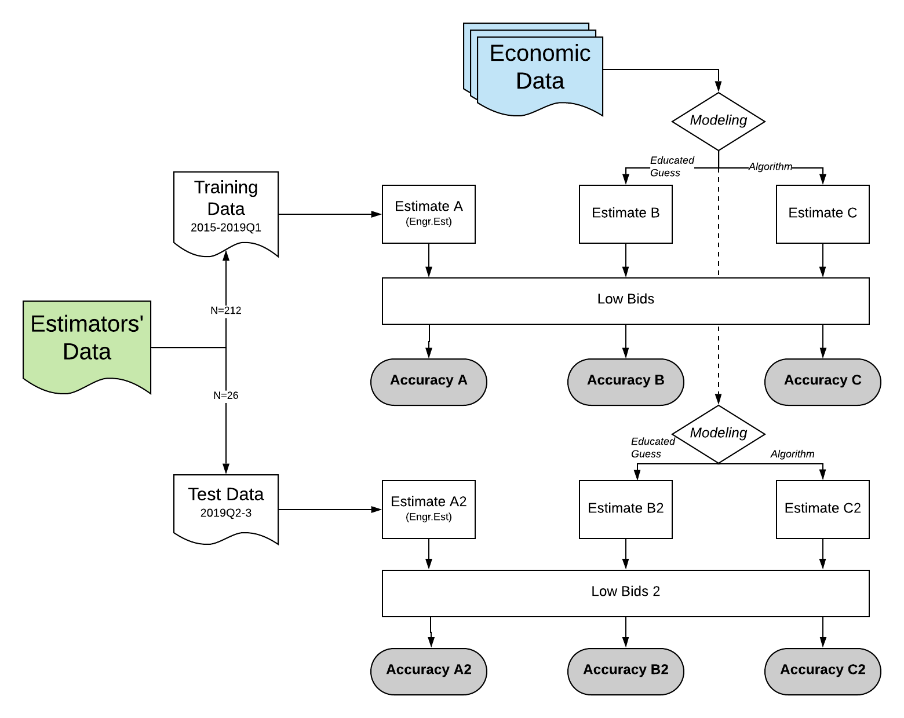

\pagenumbering{arabic}

The agency estimates project costs internally. It may be able to use statistics to improve those predictions. 

Model variation in bids, withholding the two most recent quarters of observations. Then test those models on the withheld observations. How well do they help with predictions? 

#Methods and Data.
  1. Basic (manually constructed linear model), 
  2. Lasso (penalized regression - machine learning). 
  
The project-level data comes from internal agency cost estimation.  
The economic data is just quarterly stuff from the usual suspects and is specific to national and regional economic and labor market conditions. 

Load some programming tools that are commonly used for this analysis. Not all of these packages will be used, and at some point it'll be worth backing up and cleaning the list. 

```{r echo=FALSE, results="hide", message = FALSE, warning = FALSE}
rm(list = ls()) # clear global environment 
cat("\014") # clear the console 

library(olsrr) 
library(data.table) 
library(ggplot2) 
library(lubridate) 
library(doBy) 
library(DataCombine) 
library(dplyr) 
library(compare) 
library(StatMeasures) 
library(caret) 
library(mlbench) 
library(glmnet) 
library(tidyr) 
library(tidyverse) 
library(broom) 
library(tidytext) 
library(widyr) 
library(Matrix) 
library(MLmetrics) 
#install.packages("mltools", repos = "http://cran.us.r-project.org") 
library(mltools) 
```

#Overview. 
This effort bridges exploration of the agency's data with potential predictors from exogenous sources. 
The key idea is that if economic indicators (numbers) can add measurable value to the agency's cost estimation methods, it can help set the agency up for better informed next steps. Those next steps are yet to be defined. 

```{r}
#
```

The measures of "accuracy" are, for now, bivariate correlation. We discuss below why it's not yet time for fancier metrics, but the process above represents a first cut at trying to add a little more statistical value to the process. 

Data comes from a few sources and needs to be merged. Two usual suspects are the agency's internal project information and a set of economic indicators specific to Greater New York (18 counties on both sides of the Hudson River). 

```{r echo=FALSE, results="hide", message = FALSE, warning = FALSE}
#setwd("C:/Users/ceshleman/Dropbox/Work and research/Port Authority/Construction_git") 
setwd("~/Dropbox/Work and research/Port Authority/construction_bids") 
bids = read.csv("./Bid data 2019q3.csv") 
bids$Year = as.factor(bids$Year) 
head(bids) 
bids$Date = as.Date(bids$Date,"%m/%d/%Y") 
bids = bids[order(bids$Date),] # Sort things by date 
bids$Engr.Est = as.numeric(bids$Engr.Est) 

bids$Quarter = quarter(bids$Date) 
bids$Quarter = paste("Q",quarter(bids$Date), sep="") 
bids$Q = paste(bids$Year,bids$Quarter,sep="-") 

econ = read.csv("./Economics 2019Q2.csv") 
econ$Q = paste(econ$Year,econ$Quarter,sep="-")

econ$Year = NULL  
econ$Quarter = NULL 
bids$Year = NULL 
bids$Quarter = NULL 

bids = merge(bids,econ, by = "Q", all.x=TRUE) 

rm(econ) 
```

## Add permits and steel prices.
The City of New York's database on permitting covers comercial and residential activity. 

I'd like to ask have robust data on the rest of the region, including 
(and namely) Jersey City, but it's weaker than the City's, which by itself is 
a decent barometer of construction activity in greater New York. 

Prices of construction materials and labor also figure into the agency's internal cost estimation, and I'll use steel prices for now. Future models might try and rope in other pricing data points, but the estimators are generally already taking prices into account when setting their numbers so this is likely of second- and third-order importance but the modeling selection algorithms may suggest using them. 

```{r echo=FALSE, results="hide", message = FALSE, warning = FALSE}
permits_short = read.csv("./Permits_short.csv") 
names(permits_short) 
permits_short$X=NULL 
names(permits_short) = c("Q","permits","permits_1") 
bids = merge(bids, permits_short, by = "Q", all.x=TRUE) 
rm(permits_short) 

steel = read.csv(url("https://fred.stlouisfed.org/graph/fredgraph.csv?bgcolor=%23e1e9f0&chart_type=line&drp=0&fo=open%20sans&graph_bgcolor=%23ffffff&height=450&mode=fred&recession_bars=on&txtcolor=%23444444&ts=12&tts=12&width=748&nt=0&thu=0&trc=0&show_legend=yes&show_axis_titles=yes&show_tooltip=yes&id=WPU101707&scale=left&cosd=1982-06-01&coed=2019-08-01&line_color=%234572a7&link_values=false&line_style=solid&mark_type=none&mw=3&lw=2&ost=-99999&oet=99999&mma=0&fml=a&fq=Monthly&fam=avg&fgst=lin&fgsnd=2009-06-01&line_index=1&transformation=lin&vintage_date=2019-09-29&revision_date=2019-09-29&nd=1982-06-01")) 

names(steel) = tolower(names(steel)) 
steel$date = as.Date(steel$date, format="%Y-%m-%d") 

names(steel) = trimws(names(steel)) 
steel$Quarter = paste("Q",quarter(steel$date), sep="") 
steel$month = month(steel$date) 
steel = subset(steel,steel$month==2 | steel$month==5 | steel$month==8 | steel$month==11) 
steel$month=NULL 
steel$Q = paste(year(steel$date),steel$Quarter,sep="-") 
steel = data.frame(steel$wpu101707,steel$Q) #WPU101707 
names(steel) = c("steel","Q") 

bids = merge(bids, steel, by = "Q", all.x=TRUE) 
rm(steel) 
``` 

Stats software treats different variables in different ways depending on individal formatting. It's worth taking a look at the data structure. 

I'll need to tell the software to reformat some of the variables, namely the economic indicators. 

```{r, echo=FALSE, include=TRUE, message = FALSE, warning = FALSE}
bids$Employment.in.construction = as.numeric(as.character(bids$Employment.in.construction)) 
bids$Output.in.construction = as.numeric(as.character(bids$Output.in.construction)) 
bids$Total.population = as.numeric(as.character(bids$Total.population)) 
bids$Total.employment = as.numeric(as.character(bids$Total.employment)) 
bids$Total.output = as.numeric(as.character(bids$Total.output)) 
```

One variable of interest is the bidding process. Institutional discussions and earlier modeling suggests the bidding process may influence the bids. Limits placed on the range of bidders, for example, could, on average and holding other things constant, increase the average (and lowest qualifying) bid - this is basic microeconomics. I'll simplify the bidding format variable by making it binary: "public" for projects without significant constraints and "other" for ones, such as projects closed to firms not deemed "small business enterprises," that aren't. 

```{r echo=FALSE}
bids$Format = as.factor(ifelse(bids$Format=="Public","Public","Other")) 
```

There's room to also eventually include the names (anonymized is fine) of each project estimator to help modeling. Past work has suggested there isn't major causal variation between estimators — they generally do a pretty equivalent job in estimating bids. But having their names included nonetheless may prove to offer some control value. We can leave that to future modeling. 

#Restating objective. 

We want to understand whether and how we might help the agency estimate the actual cost of a project. That's invariably going to be represented by the low qualifying bid, and our starting point is the estimate coming from the Engineering Department. 

From here on we'll define "accuracy" as the ratio of dollars estimated over dollars bid. So a "1" would mean the engineering team nailed it, a "0.94" would mean they estimated 94 cents for every 1 dollar in the low bid, et cetera. 

```{r echo=FALSE}
bids$accuracy = bids$Engr.Est / bids$Low.Bid 
bid = bids # backup my data frame 
```

I think there's a pesky outlier in there - a project that, for a strange reason (unexplainable), was way off. We suggest removing it. 

```{r echo=FALSE}
plot(bids$accuracy) 
bids = subset(bids,bids$accuracy<3) # remove major outliers 
```


#Analysis
Now the data is prepped. 
So split it into the training  / test sets we talked about at the start. The bids start in 2015. 
  
```{r echo=FALSE, results="hide", message = FALSE, warning = FALSE}
head(bids) 
summary(bids$Date) 
train = subset(bids,bids$Date<"2019-03-31") 
test = subset(bids,bids$Date>="2019-04-01") 
```

# Motivation. 
Why do we think developing a conrolled multivariate (complicated) model will be worth it? Well, the average gap is $2.5 million, or 20%, off of our estimates. What's the raw (uncontrolled) bivariate relationship between engineering estimates and low bids? 

```{r, echo = FALSE, message = FALSE, warning = FALSE}
ggplot(bids, aes(x=log(Low.Bid), y=log(Engr.Est))) + geom_point(size=2,shape=1)
summary(lm(bids$Low.Bid ~ bids$Engr.Est)) 
```

(The logarithm is just to distribute it across the plot (one of the observations is an outlier).) 

The in-house engineers arguably do a pretty good job - they're guesses predict more than 97% of the variation in low bids. 

Some of the remaining variation can be explained with some guesswork. 

Location seems to have some predictive power. Not a ton, but a little. 
Basically, projects that somehow span the Hudson River wind up costing more, on average, than ones plunked squarely in either New York or New Jersey. What's the raw (uncontrolled) relationship between bid accuracy and location? 

```{r, echo = FALSE, message = FALSE, warning = FALSE}
summary(lm(bids$accuracy ~ bids$Loc)) 
ggplot(bids, aes(x=Loc, y=accuracy)) + 
  geom_boxplot(outlier.shape=NA) + #avoid plotting outliers twice
  geom_jitter(size=.8,position=position_jitter(width=.1, height=0), aes(color = Loc)) +   theme(legend.position="none") 
```

There's a weak (like very weak) signal that projects that are in the middle of the pack in terms of size (in dollar terms) may be more evasive than much larger or smaller projects. What's the relationship between low bids and accuracy, when we start considering the size of low bids? 

```{r, echo = FALSE, message = FALSE, warning = FALSE}
bids$decile = decile(vector = bids$Low.Bid) 
summary(lm(bids$accuracy ~ as.factor(bids$decile))) 
ggplot(bids, aes(x=as.factor(decile), y=accuracy)) + 
  geom_boxplot(outlier.shape=NA) + #avoid plotting outliers twice
  geom_jitter(size=.8,position=position_jitter(width=.1, height=0), aes(color = as.factor(decile))) +  
  theme(legend.position="none") 
```

The signal is stronger regarding the type of project, which has an identifiable (if yet uncontrolled) relationship with estimating accuracy. What's the raw (uncontrolled) relationship between estimation accuracy and the type of project? 

```{r, echo = FALSE, message = FALSE, warning = FALSE}
summary(lm(bids$accuracy ~ as.factor(bids$Typeology))) 
ggplot(bids, aes(x=Typeology, y=accuracy)) + 
  geom_boxplot(outlier.shape=NA) + #avoid plotting outliers twice
  geom_jitter(size=.8,position=position_jitter(width=.1, height=0), aes(color = Typeology)) + 
  theme(legend.position="none") 
```

Visualizing and testing the data iteratively like this has offered some initial insight into what might be accounting for variation in accuracy. 


# Modeling and prediction

Try and use exogenous covariates to predict an alternative engineering estimate, without using the low bid information, that might be closer to the low bid. 
Call it "expected low bid" or something so we can remember what we're trying to get. 

##A. Base model (manual selection) 
Interpretation: specification was manual and intuitive. 

Note: ensure the "accuracy" variable we calculated earlier is dropped before modeling or I'll be introducing some dual (reverse) causality, which will confuse the models. 

Note 2: when a number appears in the output without context, it is likely an information criterion (and AIC), which may or may not provide value post-modeling. 

```{r, echo=FALSE, message = FALSE, warning = FALSE}
train$accuracy=NULL 
test$accuracy=NULL 
base = lm(Low.Bid ~ Engr.Est + Employment.in.construction + permits_1 + steel, data = train) 

  summary(base) 
  options(scipen=999)
  mse_b = round(mse(train$Low.Bid,base$fitted.values),0)
  adjr_b = round(summary(base)$adj.r.squared,3)
```

The equation above throws extra information at the engineering estimate and tries to 
predict the low qualifying bid. If the result is noticably closer to the low qualifying bid than the original estiamte, you can use the delta as a post-estimation fudge factor to adjust your final estimate.

The numbers calculated above include a few metrics to use in comparing the three estimates against the objective data point at the low bid, which is what we're trying to predict. Ghose three estimates I'm talking about are: 
  1. The original, raw engineering cost estimate,
  2. The first alternative, where we built a model by hand to try and use a few more data points to enhance the original estimate, and; 
  3. The second alternative, a kitchen sink model that throws even more data points at the question. This followed an effort to use a penalized regression to identify the best covariates, but that penalization algorithm actually suggested there isn't much we can do to enhance the original estimate. (Note: this will prove prescient.)

I'll build a table near the very end of this script that summarize the metrics I'm using to understand how well these modeling efforts work. The metrics will be: 
  A. A basic t-test to understand whether there's even a statistically significant difference between the estimate I'm getting and the enhanced estimate I'm modeling with it, 
  B. A correlation between the two numbers, to try and understand the magnitude of that difference (if we can trust it really exists), 
  C. Two measures of the predictive modeling power of the models, an adjusted R-squared and the mean squared error (MSE). Both are common metrics of power. The first can be viewed discretely for each model but the second only provides a relative measure between models. 
  
What is the summary of the predicted values? 
How does it compare to the summary of low bids? 

```{r, echo=FALSE, message = FALSE, warning = FALSE}
summary(base$fitted.values) 
summary(train$Low.Bid) 
```

Looking at the two summaries above, what's more accurate, the original engineering estimate or the first enhanced prediction? Neither, really. In fact the estimate and prediction aren't even (statistically) significantly different. Maybe something more robust can come with a little creativity. 

(Note: the model should control to prevent negative values. To be done next time.)


## B. Machine learning
Strip the bids data of unusable stuff, then set controls and run.
The package I'm using, glmnet, requires a little extra preparation.

The output below represents the algorithm's effort to look for variatbles that might be dependable in adding predictive power to the original engineering estimate. 

```{r, echo=FALSE, message = FALSE, warning = FALSE}
train2 = train[,-c(1:5,8:10,12,14,52,56)] 
test2 = test[,-c(1:5,8:10,12,14,52,56)] 

compare = lm(Low.Bid ~ ., data=train2) 

XP=data.matrix(train2)  #XP=data.matrix(train2[,-3])
YP=data.matrix(train2$Low.Bid) 
lasso=cv.glmnet(x=XP, y=YP, alpha=1, nfolds=30, 
                type.measure="mse", family="gaussian") 

plot(lasso) 
coef(lasso, s=lasso$lambda.1se) 
coef(lasso, s=lasso$lambda.min) 
```

My first cut with machine learning isn't providing any suggestions to improve the model prediction. Basically the algorithm is telling me using anything beyond the engineer's estimate itself to better predict the lowest qualifying good adds more uncertainty (in the form of noise that's tough to explain) than it adds value. (The "penalty" associated with adding variables is greater than the extra predictive power they bring.) 

```{r, echo=FALSE, message = FALSE, warning = FALSE}
mse_c = round(mse(test$Low.Bid,compare$fitted.values),0)
adjr_c = round(summary(compare)$adj.r.squared,3)
```

#Accuracy 

Fascinating. 
I first tried calculating a metric that captures accuracy (the relationship between the estimate and the actual). We wanted to use a weighted average of the ratio between estimate and actuals. Something like this ... 

accuracy_a = weighted.mean((train$Engr.Est/train$Low.Bid),train$Low.Bid) 

... applied across all three prisms (uncontrolled and the two models). 

But that calculation just results in 1 (and exactly 1) for both models. 
So we tried something different, summing the estimates and (separately) the actuals, and then dividing those totals. But that also gave me 1 because the average estimate and the average actual are exactly the same, down to the dollar. 

How can we be estimating the value that well, on average? The model must be optimized with respect to the average dependent value. 

But this is a question for another time. For now I'll just need to lean on other metrics as indications of accuracy: 

```{r echo=FALSE}
accuracy_a = cor(train$Engr.Est,train$Low.Bid) 
accuracy_b = cor(base$fitted.values,train$Low.Bid) 
accuracy_c = cor(compare$fitted.values,train$Low.Bid) 
```

Well, the correlations between estimates and actuals do show signals of tightening up slightly. But how robust is this, really? Are the numbers really different? And how would the two models perform on fresh data? 

##Compare new estimates to original estimates.
```{r echo=FALSE}
ttest_a = "NA" 
ttest_b = t.test(base$fitted.values,train$Engr.Est)$p.value
ttest_c = t.test(compare$fitted.values,train$Engr.Est)$p.value
```
No statistically significance differences to be found in either case. 

##Run on the withheld data and check.

We've already got the models (both of them): "base" and "compare". 

```{r, echo=FALSE, message = FALSE, warning = FALSE}
test_accuracy_a = cor(test$Low.Bid,test$Engr.Est) 

base2 = lm(Low.Bid ~ Engr.Est + Employment.in.construction + permits_1 + steel, data = test) 

  options(scipen=999)
  estimate_b2 = base2$fitted.values #predict(compare,train2) 
  test_mse_b = round(mse(test$Low.Bid,base2$fitted.values),0)
  test_accuracy_b = cor(test$Low.Bid,base2$fitted.values) 
  test_adjr_b = round(summary(base2)$adj.r.squared,3)
  test_ttest_b = t.test(base2$fitted.values,test$Engr.Est)$p.value
```

Results for the broader model: 

```{r echo=FALSE}
compare2 = lm(Low.Bid ~ ., data=test2) 
  estimate_c2 = compare2$fitted.values #predict(compare,train2) 
  t.test(estimate_c2,test2$Engr.Est) 
  test_mse_c = round(mse(test2$Low.Bid,estimate_c2),0)
  test_accuracy_c = cor(test2$Low.Bid,compare2$fitted.values) 
  test_adjr_c = round(summary(compare2)$adj.r.squared,3)
  test_ttest_c = t.test(compare2$fitted.values,test2$Engr.Est)$p.value
```


#Compare
```{r echo=FALSE, message = FALSE, warning = FALSE}
table_1 = c("none","base","lasso") 
table_2 = c("NA",round(ttest_b,3),round(ttest_c,3)) 
table_3 = c(round(accuracy_a,3),round(accuracy_b,3),round(accuracy_c,3)) 
table_4 = c("NA",adjr_b,adjr_c) 
table_5 = c("NA",formatC(mse_b, big.mark=","),formatC(mse_c, big.mark=",")) 
table_6 = c("NA",round(test_ttest_b,3),round(test_ttest_c,3))
table_7 = c(round(test_accuracy_a,3),round(test_accuracy_b,3),round(test_accuracy_c,3))
table_8 = c("NA",round(test_adjr_b,3),round(test_adjr_c,3))
table_9 = c("NA",formatC(test_mse_b, big.mark=","),formatC(test_mse_c, big.mark=","))
```

This is a table comparing performance of: 
1. The raw estimates, 
2. The manually-developed model, and, 
3. The informed model 
along some key measures. The p-values (below 0.1 is strong) and correlation (closer to 1 is strong) can be considered discretely for the two models (and, for correlation, the raw estimate), as they reflect how strongly predicted bids and actual bids are related, and the adjusted R-squared (closest to 1 is best) and mean squared error (MSE; lower is best) data points offer technical insight into how well each model performs ... 

For the training exercise (data from 2015-Q1 2019): 
```{r echo=FALSE}
results_train = as.data.frame(cbind(table_1,table_2,table_3,table_4,
                      table_5));
names(results_train) = c("model","p-value","cor","adj-R2","MSE")  
results_test = as.data.frame(cbind(table_1,table_6,table_7,table_8,table_9));
names(results_test) = c("model","test_p-value","test_cor","test_adj-R2","test_MSE") 
rm(table_1,table_2,table_3,table_4,table_5,table_6,table_7,table_8,table_9) 
#results 
t(results_train) 
```

For the test (data withheld, from Q2 and Q3 2019): 
```{r echo=FALSE}
t(results_test) 
```

# Discussion. 
The model we selected myself doesn't do much better than the engineer's estimate. And the model with automated variable selection via LASSO doesn't really do any better than the one by hand. 